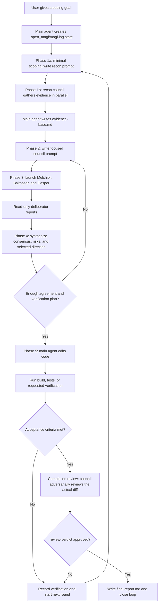

# open_magi

English | [Traditional Chinese](README.zh-TW.md) | [Codex experimental notes](adapters/codex/README.md) | [Claude experimental notes](adapters/claude/README.md)

`open_magi` packages the Magi deliberation loop for coding agents. The stable
runtime today is the installable OpenCode plugin. Experimental Codex and Claude
Code support are available as skill-first adapter plugins, without full runtime
backstop parity yet.

## What It Does

Open Magi is for coding tasks where a single agent can get stuck in one line of
reasoning, skip verification, or stop before the task is actually done. It turns
one coding agent into a controlled Magi loop:

1. The main agent records the goal, acceptance criteria, and verification
   commands under `.open_magi/magi-log/`.
2. In round 1, the main agent does only minimal scoping, then a recon council
   pass: all three deliberators investigate read-only in parallel, and the main
   agent synthesizes their findings into `evidence-base.md`.
3. Three read-only deliberators review the problem from different angles:
   Melchior for implementation risk, Balthasar for architecture, and Casper for
   root cause and verification gaps.
4. The main agent synthesizes their reports into a selected direction and, when
   needed, asks the council for more passes before making code changes.
5. Only after a clear verdict does the main agent edit code, run verification,
   record `verdict_adherence: yes|no`, and either continue another round or
   claim completion.
6. A completion claim triggers one adversarial review council pass: the three
   deliberators review the actual diff against the verdict, verification
   output, and acceptance criteria. Only an approved `review-verdict.md` allows
   `final-report.md` and closes the loop; objections start the next round.
7. Runtime backstops, where supported, keep the loop from silently stopping,
   asking procedural questions, or accepting missing artifacts.

The important distinction is that the deliberators do not edit files. They
produce reports. The main agent remains responsible for choosing the direction,
making changes, running tests, and writing the final report.

## Runtime Flow



## Support Status

OpenCode is the only production-supported coding-agent runtime today. The
current installer, config writer, runtime hook, and strongest guardrails are
designed for OpenCode.

Codex support is experimental. It exposes the `magi` skill through Codex plugin
discovery, but timeout enforcement, auto-continue, question denial, and artifact
repair still need a Codex-native runtime adapter.

Claude Code support is experimental. It exposes `/open-magi:magi`, three native
plugin agents, a headless `run-council` runner, and a conservative Stop hook
through `adapters/claude`.

Future plan:

1. Stabilize the OpenCode plugin and Magi protocol through real project usage.
2. Validate Codex-native hooks and subagents for runtime backstop parity.
3. Harden Claude Code native plugin-agent behavior through real usage.
4. Add a Copilot CLI adapter if its extension points can support the required
   loop control, subagent delegation, and artifact checks.

Each future adapter should use the coding agent's own install path and runtime
model. The shared Magi protocol can be reused where practical, but OpenCode
runtime hooks are not assumed to work in other agents.
Adapter-specific config files should live under that coding agent's own config
directory, not in a shared Open Magi global directory.

## Adapter Package Layout

The repository keeps shared Magi protocol assets separate from installable
adapter packages:

```text
shared/magi/
  prompts/
  references/

skills/magi/
  OpenCode-installed magi skill

adapters/codex/
  .codex-plugin/
  bin/
  hooks/
  lib/
  skills/magi/

adapters/claude/
  .claude-plugin/
  agents/
  bin/
  hooks/
  lib/
  skills/magi/
```

`shared/magi` is source-of-truth maintenance material only. It is not installed
into OpenCode or Codex. Tests enforce that shared prompts and common references
stay identical across adapter skills while allowing adapter-specific runtime
references.

The OpenCode npm package contains only the OpenCode runtime plugin, OpenCode
setup CLI, and OpenCode `skills/magi`. The Codex marketplace entry points at
`./adapters/codex`, so Codex installs only the Codex plugin manifest, Codex
Stop hook, Codex setup CLI, and Codex `skills/magi`.

Claude Code support is packaged separately under `adapters/claude`, so Claude
installs only the Claude plugin manifest, Claude plugin agents, Claude Stop
hook, setup/runner CLI, and Claude `skills/magi`.

## Development Hygiene

Small changes, documentation edits, and routine debugging may be committed
directly on `main`. Use a feature branch for risky or large changes, then merge
back to `main` after verification.

Keep real runtime logs, local test data, and personal notes out of the
repository. `.gitignore` excludes `.open_magi/`, `docs/superpowers/`, `.env`
files, editor swap files, and `tmp/` for this purpose. Test fixtures should use
generic paths such as `/tmp/open_magi_repo` and generic users such as
`example-user`.

Before pushing public changes, run:

```bash
npm test
npm pack --dry-run
git diff --check
```

## Install

Until the npm package is published, install directly from this public GitHub
repo with the per-runtime steps below. The one-command flows that skip these
steps are known to be unreliable today: `opencode plugin git+https://...`
depends on the host's package tooling, and `codex plugin add` cannot install
plugins that live in a repository subdirectory.

### Claude Code (direct from GitHub)

```bash
claude plugin marketplace add ladiossoop5star/open_magi
claude plugin install open-magi@open-magi
```

### OpenCode (clone + local link)

```bash
git clone https://github.com/ladiossoop5star/open_magi /path/to/open_magi
mkdir -p ~/.config/opencode/node_modules
ln -s /path/to/open_magi ~/.config/opencode/node_modules/open-magi-opencode
node /path/to/open_magi/bin/open-magi.js setup --allow-default-model
```

Then edit `~/.config/opencode/opencode.json` (or `opencode.jsonc`) and replace
the three `default-model` values with real models for deliberator-melchior,
deliberator-balthasar, and deliberator-casper, and restart OpenCode.

### Codex (clone + cache sync)

```bash
git clone https://github.com/ladiossoop5star/open_magi /path/to/open_magi
node /path/to/open_magi/adapters/codex/bin/open-magi.js install-codex
codex plugin marketplace add /path/to/open_magi
```

Make sure `~/.codex/config.toml` contains
`[plugins."open-magi@open-magi-dev"]` with `enabled = true`, then configure
the three `~/.codex/agents/deliberator-*.toml` model values as described in
[Codex experimental notes](adapters/codex/README.md).

### Ask an AI agent to install it

OpenCode:

```text
Please install the public OpenCode plugin `open-magi-opencode` from the `open_magi` repo:
https://github.com/ladiossoop5star/open_magi. Clone the repo, link it into
~/.config/opencode/node_modules as open-magi-opencode, then run
`node <repo>/bin/open-magi.js setup --allow-default-model`. Do NOT use
`opencode plugin git+https://...`; it is unreliable for this repo. Afterwards,
set real model values for deliberator-melchior, deliberator-balthasar, and
deliberator-casper in ~/.config/opencode/opencode.json (or opencode.jsonc),
and confirm ~/.config/opencode/skills/magi/SKILL.md exists.
```

Codex:

```text
Please install the Open Magi Codex adapter from the `open_magi` repo:
https://github.com/ladiossoop5star/open_magi. Clone the repo, run
`node <repo>/adapters/codex/bin/open-magi.js install-codex`, then
`codex plugin marketplace add <repo>`. Do NOT use `codex plugin add`; it
cannot install plugins that live in a repository subdirectory. Make sure
~/.codex/config.toml has [plugins."open-magi@open-magi-dev"] with
enabled = true, then set real model values in
~/.codex/agents/deliberator-melchior.toml, deliberator-balthasar.toml, and
deliberator-casper.toml.
```

Claude Code:

```text
Please install the Open Magi Claude Code plugin from the `open_magi` repo:
https://github.com/ladiossoop5star/open_magi. Run
`claude plugin marketplace add ladiossoop5star/open_magi` and
`claude plugin install open-magi@open-magi`. If I want concrete deliberator
models, clone the repo and run
`node <repo>/adapters/claude/bin/open-magi-claude.js setup-claude
--melchior-model <model> --balthasar-model <model> --casper-model <model>`
instead. Restart Claude Code or run /reload-plugins afterwards.
```

After the npm package is published, the shorter npm install path will be:

```bash
opencode plugin open-magi-opencode -g
```

Use models already configured in your OpenCode `opencode.json`. You can use one
shared model for all three deliberators, or give Melchior, Balthasar, and Casper
different models. Restart OpenCode after editing the model values.

## Codex Experimental Notes

Codex support is packaged separately under `adapters/codex`. Do not use the
OpenCode npm package or OpenCode setup command for Codex. See
[Codex experimental notes](adapters/codex/README.md) for the current install,
setup, and limitation details.

## Claude Experimental Notes

Claude Code support is packaged separately under `adapters/claude`. Do not use
the OpenCode npm package or OpenCode setup command for Claude. From a local
checkout, add this repo as a Claude plugin marketplace and install the Claude
adapter:

```bash
claude plugin marketplace add /path/to/open_magi
claude plugin install open-magi@open-magi
```

For local development, validate and load the plugin directly with:

```bash
claude plugin validate adapters/claude
claude --plugin-dir /path/to/open_magi/adapters/claude
```

For separate Melchior, Balthasar, and Casper models, generate a local Claude
skills-dir plugin with concrete agent `model:` values:

```bash
node /path/to/open_magi/adapters/claude/bin/open-magi-claude.js setup-claude \
  --melchior-model model-a \
  --balthasar-model model-b \
  --casper-model model-c
```

If the CLI package is installed, use:

```bash
open-magi-claude setup-claude \
  --melchior-model model-a \
  --balthasar-model model-b \
  --casper-model model-c
```

The generated plugin lives under `~/.claude/skills/open-magi`. If
`open-magi@open-magi` was installed from the marketplace, uninstall it before
using the generated skills-dir plugin:

Manual Claude deliberator model configuration lives in the generated agent
frontmatter. Edit these three files and change only the `model:` value:

```text
~/.claude/skills/open-magi/agents/deliberator-melchior.md
~/.claude/skills/open-magi/agents/deliberator-balthasar.md
~/.claude/skills/open-magi/agents/deliberator-casper.md
```

Example:

```yaml
---
name: deliberator-melchior
model: claude-haiku-4-5-20251001
tools: ["Read", "Grep", "Glob"]
---
```

```bash
claude plugin uninstall open-magi@open-magi
```

Restart Claude Code or run `/reload-plugins` after changing plugin files.

During Magi Phase 3, Claude uses the runner instead of relying on the main
Claude agent to launch three `Agent` tool calls:

```bash
node ~/.claude/skills/open-magi/bin/open-magi-claude.js run-council \
  --project-root "$PWD" \
  --prompt-path ".open_magi/magi-log/round-NNN/council-PPP/prompt.md" \
  --round N \
  --pass P
```

The runner launches three headless Claude subprocesses concurrently and writes
`report-melchior.md`, `report-balthasar.md`, and `report-casper.md`.
If the CLI is on PATH, use `open-magi-claude run-council` with the same
arguments.

Then invoke:

```text
/open-magi:magi goal: fix the tests until npm test passes. Verification command: npm test.
```

If your environment uses a local Claude wrapper for local LLM routing, start
Claude through that local Claude wrapper. See
[Claude experimental notes](adapters/claude/README.md) for native plugin agent,
Stop hook, and limitation details.

## Update

If you installed directly from this GitHub repo, use the same source with
`--force`:

```bash
opencode plugin git+https://github.com/ladiossoop5star/open_magi.git -g -f
```

After the npm package is published, replace the installed plugin version and
refresh the local skill files with:

```bash
opencode plugin open-magi-opencode -g -f
```

The plugin install hook refreshes `~/.config/opencode/skills/magi` and
preserves unrelated OpenCode configuration. If the three model values are still
`default-model`, edit them manually or use the setup command below to write real
models directly.

## What Installation Writes

Plugin installation writes to the OpenCode config directory. By default this is:

```text
~/.config/opencode/
```

Generated or updated files:

```text
~/.config/opencode/opencode.json
~/.config/opencode/skills/magi/SKILL.md
~/.config/opencode/skills/magi/prompts/melchior.md
~/.config/opencode/skills/magi/prompts/balthasar.md
~/.config/opencode/skills/magi/prompts/casper.md
```

The install hook preserves unrelated `provider`, `agent`, and `plugin`
configuration. It adds or updates:

- `plugin[]`: `open-magi-opencode`, unless OpenCode already registered this
  repository package directly.
- `agent.deliberator-melchior`
- `agent.deliberator-balthasar`
- `agent.deliberator-casper`

All three deliberator agents are configured as subagents with `edit=deny`,
`bash=deny`, and `question=deny`, so they cannot modify files, run commands,
or escalate questions to the user.

## Setup Options

The CLI setup command is optional. Use it to repair or regenerate config if the
install hook was skipped. To intentionally write editable `default-model`
placeholders, make that explicit:

```bash
open-magi setup --allow-default-model
```

Then edit `~/.config/opencode/opencode.json` and replace:

```text
agent.deliberator-melchior.model
agent.deliberator-balthasar.model
agent.deliberator-casper.model
```

One model for all three deliberators, without placeholders:

```bash
open-magi setup \
  --model deepseek-v4-flash \
  --config-dir ~/.config/opencode \
  --plugin-spec open-magi-opencode
```

Independent deliberator models:

```bash
open-magi setup \
  --melchior-model model-a \
  --balthasar-model model-b \
  --casper-model model-c
```

Dry run:

```bash
open-magi setup --model deepseek-v4-flash --dry-run
```

Environment overrides:

```bash
OPEN_MAGI_MODEL=deepseek-v4-flash open-magi setup
OPEN_MAGI_MELCHIOR_MODEL=model-a \
OPEN_MAGI_BALTHASAR_MODEL=model-b \
OPEN_MAGI_CASPER_MODEL=model-c \
  open-magi setup
OPENCODE_CONFIG_DIR=/path/to/opencode-config open-magi setup --model deepseek-v4-flash
```

Interactive prompt mode:

```bash
open-magi setup --interactive
```

## Usage

Start OpenCode in a project after installation:

```bash
opencode .
```

Then ask for Magi:

```text
magi, goal: fix the tests until npm test passes.
```

Equivalent trigger examples:

```text
magi, goal: complete this refactor and run verification.
three-sages loop, goal: diagnose this bug and fix it.
deliberation loop until done.
```

## Runtime Files

For each project where Magi runs, runtime logs are written under:

```text
.open_magi/magi-log/
```

Expected layout:

```text
.open_magi/magi-log/
├── state.json
├── checklist.md
├── round-001/
│   ├── recon-001/
│   │   ├── prompt.md
│   │   ├── report-melchior.md
│   │   ├── report-balthasar.md
│   │   └── report-casper.md
│   ├── evidence-base.md
│   ├── research-prompt.md
│   ├── council-001/
│   │   ├── prompt.md
│   │   ├── report-melchior.md
│   │   ├── report-balthasar.md
│   │   ├── report-casper.md
│   │   └── synthesis.md
│   ├── verdict.md
│   ├── verification.md
│   ├── cleanup.md
│   ├── review-001/
│   │   ├── prompt.md
│   │   ├── report-melchior.md
│   │   ├── report-balthasar.md
│   │   └── report-casper.md
│   └── review-verdict.md
└── final-report.md
```

`checklist.md` is a required phase-transition gate. Magi reads it before
moving phases, and the plugin can reopen a loop if required artifacts such as
`council-001/report-melchior.md`, `council-001/report-balthasar.md`, or
`council-001/report-casper.md` are missing.

`verification.md` must explicitly confirm whether execution followed the
approved `verdict.md` with `verdict_adherence: yes`. If execution drifted, the
round cannot be finalized; the new evidence must go to the next council round.

`recon-001/` exists only in round 1: the main agent does minimal scoping, then
all three deliberators gather evidence in parallel before any direction is
chosen. `review-001/` and `review-verdict.md` gate completion: when the main
agent claims the goal is met, the cleanup gate first audits the round's full
diff and removes redundant or ineffective changes (`cleanup.md`), then the
council adversarially reviews the actual diff. `final-report.md` is allowed
only after `outcome: approved` with `verdict_adherence_confirmed: yes`. Loops
that close without an approved review verdict are reopened by the plugin and
the stop hooks.

Before code changes, Magi can run multiple bounded council passes in one round:
the default maximum is 3, the hard maximum is 5, and early passes use veto
rules to avoid premature implementation. If the council still cannot fully
converge at the limit, Magi must choose the smallest reversible verifiable next
action instead of asking the user for debug direction.

Deliberator timeout is enforced by the plugin, not just by prompt text. The
default timeout is 30 minutes per deliberator child session. When a deliberator
times out, the plugin calls OpenCode `session.abort` for that child session and
writes the corresponding timeout report under the active council directory,
for example:

```text
.open_magi/magi-log/round-001/council-001/report-melchior.md
```

Timeout reports use `status: timeout`, `stance: needs_evidence`, and
`blocking_objection: yes`, so the council gate can continue deterministically
without asking the user what to do.

The plugin also guards the phases in real time. Before each tool call
(`tool.execute.before`), an active loop denies project code changes and
build/test commands outside the execution phase, and execution-phase edits
require `round-NNN/verdict.md`; writes under `.open_magi/` are always allowed.
After each tool call (`tool.execute.after`), it appends a one-line
`follow the open_magi process` reminder to the tool result when the loop
signature changes or after a ten-minute heartbeat. Closed v2 loops whose
`review-verdict.md` lacks `outcome: approved` or
`verdict_adherence_confirmed: yes` are reopened for repair.

## Test

```bash
npm test
npm pack --dry-run
```

Live E2E tests require a working OpenCode provider. In this environment, use:

```bash
opencode run --agent build --model deepseek-v4-flash \
  "Use the magi skill. Goal: create result.txt with PASS. Verification command: grep -qx PASS result.txt"
```
