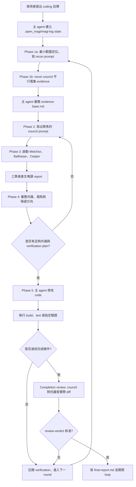

# open_magi

[English](README.md) | 繁體中文

**Open Magi 不是多智能體分工協作。** 它不是把任務切成幾塊分給不同 agent
各做各的，而是讓多個智能體**共同面對同一個難題**：三個唯讀 deliberator
從不同角度獨立調查、提案、對抗審查，主 agent 則始終握有決策、程式修改與
驗證的責任。

它要解決的痛點是：**不想或無法使用前沿模型，卻又想要接近前沿模型的能力。**
一個由較弱模型組成、會互相調查、質疑、驗證的議會，在困難的 coding 任務上
可以逼近前沿模型的表現，而不是讓單一弱模型卡住、瞎猜、或提前停手。

`open_magi` 會把 Magi 審議流程打包成可安裝的 OpenCode plugin。它會加入
`magi` skill、三個唯讀 deliberator subagent，以及一個 runtime hook，讓長任務
可以依照明確的驗證指令持續推進，直到完成為止。

## 這是做什麼的

Open Magi 是給比較複雜、容易卡住、需要多輪驗證的 coding task 用的。它不是讓
三個 subagent 自己改程式，而是把原本單一 coding agent 的工作流程改成受控的
Magi loop：

1. 主 agent 先把目標、完成條件、驗證指令寫到 `.open_magi/magi-log/`。
2. 第一輪時，主 agent 只做最小範圍定位，然後進行 recon council pass：三賢者
   平行唯讀偵查，主 agent 把發現彙整成 `evidence-base.md`。
3. 三賢者以唯讀方式評議：Melchior 看實作風險，Balthasar 看架構與維護性，
   Casper 看根因、反例與驗證缺口。
4. 主 agent 彙整三份 report，選出方向；如果共識不足，就再進下一輪評議，而不是
   直接猜方向改 code。
5. 有明確 verdict 後，才由主 agent 修改程式、跑 build/test/驗證指令，並記錄
   `verdict_adherence: yes|no`。
6. 宣稱完成時會觸發一次對抗性 review council pass：三賢者拿實際 diff 對照
   verdict、驗證輸出與完成條件審查。只有 `review-verdict.md` 核准才能寫
   `final-report.md` 並關閉 loop；有異議就帶著異議進下一輪。
7. 支援 runtime backstop 的環境會額外防止 loop 靜默停住、亂問流程問題、或跳過
   必要 artifact。

重點是：三賢者只提供 report，不改檔案、不跑建置測試。主 agent 才負責決策、
改 code、跑驗證、寫 final report。

## 流程圖


```mermaid
flowchart TD
    A[使用者提出 coding 目標] --> B[主 agent 建立 .open_magi/magi-log state]
    B --> C[Phase 1a: 最小範圍定位，寫 recon prompt]
    C --> R[Phase 1b: recon council 平行蒐集 evidence]
    R --> R2[主 agent 彙整 evidence-base.md]
    R2 --> D[Phase 2: 寫出聚焦的 council prompt]
    D --> E[Phase 3: 啟動 Melchior、Balthasar、Casper]
    E --> F[三賢者產生唯讀 report]
    F --> G[Phase 4: 彙整共識、風險與候選方向]
    G --> H{是否有足夠共識與 verification plan?}
    H -- 否 --> D
    H -- 是 --> I[Phase 5: 主 agent 修改 code]
    I --> J[執行 build、test 或指定驗證]
    J --> K{是否達成完成條件?}
    K -- 否 --> L[記錄 verification，進入下一 round]
    L --> C
    K -- 是 --> V[Completion review: council 對抗審查實際 diff]
    V --> W{review-verdict 核准?}
    W -- 否 --> L
    W -- 是 --> M[寫 final-report.md 並關閉 loop]
```

## 支援狀態

OpenCode 是目前唯一 production-supported runtime。現在最完整的 installer、
config writer、runtime hook，以及 runtime backstop 都是為 OpenCode 設計。

Codex 支援目前是 experimental。它有獨立的 Codex plugin package root、Codex
skill、Stop hook，以及 setup CLI，但還沒有 OpenCode 等級的 timeout、
auto-continue、question denial、artifact repair runtime backstop。

Claude Code 支援目前也是 experimental。它在 `adapters/claude` 內提供
`/open-magi:magi`、三個 Claude native plugin agents、headless `run-council`
runner，以及保守的 Stop hook。
可以從本機 checkout 透過 Claude plugin marketplace 安裝：

```bash
claude plugin marketplace add /path/to/open_magi
claude plugin install open-magi@open-magi
```

未來計畫：

1. 先透過實際專案使用穩定 OpenCode plugin 與 Magi protocol。
2. 驗證 Codex-native hooks 與 custom agents 是否能補齊 runtime backstop。
3. 透過實際使用強化 Claude Code native plugin-agent 流程。
4. 若 Copilot CLI 的 extension point 足以支援 loop control、subagent
   delegation、artifact 檢查，再加入 Copilot CLI adapter。

未來每個 adapter 都應該使用該 coding agent 自己的安裝路徑與 runtime 模型。
Magi protocol 可以盡量共用，但不假設 OpenCode runtime hook 能直接套用到其他
agent。各 adapter 的設定檔也應放在該 coding agent 自己的設定目錄，不放在共用
的 Open Magi global config 目錄。

## Adapter Package Layout

repo 內會把共用 Magi protocol asset 和可安裝 adapter package 分開：

```text
shared/magi/
  prompts/
  references/

skills/magi/
  OpenCode 安裝用的 magi skill

adapters/codex/
  .codex-plugin/
  bin/
  hooks/
  lib/
  skills/magi/

adapters/claude/
  .claude-plugin/
  agents/
  bin/
  hooks/
  lib/
  skills/magi/
```

`shared/magi` 只作為維護 source of truth，不會直接安裝到 OpenCode 或 Codex。
測試會強制 shared prompts/common references 和各 adapter skill 保持一致，同時
允許每個 adapter 擁有自己的 runtime reference。

OpenCode npm package 只包含 OpenCode runtime plugin、OpenCode setup CLI、
OpenCode `skills/magi`。Codex marketplace entry 指向 `./adapters/codex`，
所以 Codex 只會安裝 Codex plugin manifest、Codex Stop hook、Codex setup CLI、
Codex `skills/magi`。

Claude Code 支援獨立放在 `adapters/claude`，所以 Claude 只會載入 Claude plugin
manifest、Claude plugin agents、Claude Stop hook、setup/runner CLI，以及
Claude `skills/magi`。

## 開發衛生

小修改、文件更新、一般 debug 可以直接 commit 到 `main`。高風險或大型變更請先開
branch，驗證完成後再合併回 `main`。

真實 runtime log、本機測試資料、私人筆記不要進 repository。`.gitignore` 會擋住
`.open_magi/`、`docs/superpowers/`、`.env` 檔、editor swap files、`tmp/`。
測試 fixture 請使用 generic path，例如 `/tmp/open_magi_repo`，以及 generic user，
例如 `example-user`。

公開 push 前請先執行：

```bash
npm test
npm pack --dry-run
git diff --check
```

## 安裝

在 npm package 正式發布前，請直接從公開 GitHub repo 安裝，依 runtime 選擇
對應步驟。以下兩個一鍵指令目前都不可靠：`opencode plugin git+https://...`
依賴本機套件工具鏈，`codex plugin add` 無法安裝位於 repo 子目錄的 plugin。

### Claude Code（直接從 GitHub)

```bash
claude plugin marketplace add ladiossoop5star/open_magi
claude plugin install open-magi@open-magi
```

### OpenCode(clone + 本機連結)

```bash
git clone https://github.com/ladiossoop5star/open_magi /path/to/open_magi
mkdir -p ~/.config/opencode/node_modules
ln -s /path/to/open_magi ~/.config/opencode/node_modules/open-magi-opencode
node /path/to/open_magi/bin/open-magi.js setup --allow-default-model
```

接著編輯 `~/.config/opencode/opencode.json`（或 `opencode.jsonc`)，把三個
`default-model` 改成 deliberator-melchior、deliberator-balthasar、
deliberator-casper 要使用的 OpenCode model，然後重啟 OpenCode。

### Codex(clone + cache 同步)

```bash
git clone https://github.com/ladiossoop5star/open_magi /path/to/open_magi
node /path/to/open_magi/adapters/codex/bin/open-magi.js install-codex
codex plugin marketplace add /path/to/open_magi
```

並確認 `~/.codex/config.toml` 有 `[plugins."open-magi@open-magi-dev"]` 且
`enabled = true`，再依 [Codex experimental notes](adapters/codex/README.md)
設定三個 `~/.codex/agents/deliberator-*.toml` 的 model。

npm package 發布後，可以改用較短的 npm 安裝方式：

```bash
opencode plugin open-magi-opencode -g
```

請 AI agent 幫你安裝時，依你的 runtime 貼對應那段：

OpenCode:

```text
請從 `open_magi` repo 安裝公開的 OpenCode plugin `open-magi-opencode`：
https://github.com/ladiossoop5star/open_magi。clone repo 後,把 repo 連結到
~/.config/opencode/node_modules/open-magi-opencode,然後跑
`node <repo>/bin/open-magi.js setup --allow-default-model`。**不要**用
`opencode plugin git+https://...`,這個 repo 用它不可靠。完成後,把
~/.config/opencode/opencode.json(或 opencode.jsonc)裡
deliberator-melchior、deliberator-balthasar、deliberator-casper 設成真實
model,並確認 ~/.config/opencode/skills/magi/SKILL.md 存在。
```

Codex:

```text
請從 `open_magi` repo 安裝 Open Magi 的 Codex adapter：
https://github.com/ladiossoop5star/open_magi。clone repo 後,跑
`node <repo>/adapters/codex/bin/open-magi.js install-codex`,然後
`codex plugin marketplace add <repo>`。**不要**用 `codex plugin add`,它
無法安裝位於 repo 子目錄的 plugin。確認 ~/.codex/config.toml 有
[plugins."open-magi@open-magi-dev"] 且 enabled = true,再設定
~/.codex/agents/ 三個 deliberator-*.toml 的 model。
```

Claude Code:

```text
請從 `open_magi` repo 安裝 Open Magi 的 Claude Code plugin：
https://github.com/ladiossoop5star/open_magi。跑
`claude plugin marketplace add ladiossoop5star/open_magi` 和
`claude plugin install open-magi@open-magi`。如果我要指定 deliberator
model,改為 clone repo 後跑
`node <repo>/adapters/claude/bin/open-magi-claude.js setup-claude
--melchior-model <model> --balthasar-model <model> --casper-model <model>`。
完成後重啟 Claude Code 或跑 /reload-plugins。
```

請使用你的 OpenCode `opencode.json` 裡已設定的模型。三個 deliberator 可以共用
同一個 model，也可以讓 Melchior、Balthasar、Casper 各自使用不同 model。改完
model 後請重啟 OpenCode。

## Codex 實驗說明

Codex 支援會獨立包在 `adapters/codex`。不要用 OpenCode npm package 或
OpenCode setup 指令來設定 Codex。完整英文說明在
[Codex experimental notes](adapters/codex/README.md)，以下是繁中快速流程。

目前 Codex 支援仍是 experimental、skill-first。它會安裝 Codex 專用的 `magi`
skill、Codex Stop hook、setup CLI，以及一個會啟動三個獨立 `codex exec`
subprocess 的 council runner。它還不是 OpenCode 等級的完整 runtime adapter。

從本機 checkout 安裝 Codex plugin：

```bash
codex plugin marketplace add /path/to/open_magi
codex plugin add open-magi@open-magi-dev
```

等 Codex 支援合併回 `main` 後，也可以從 GitHub 安裝：

```bash
codex plugin marketplace add ladiossoop5star/open_magi --ref main
codex plugin add open-magi@open-magi-dev
```

確認 plugin 可見：

```bash
codex plugin list --available
```

### Codex 三賢者模型設定

Codex 版本使用 Codex custom agents 來設定 Melchior、Balthasar、Casper。第一次
使用前先產生 template：

```bash
open-magi setup-codex
```

如果本機開發時 `open-magi` 不在 `PATH`，可以直接跑 plugin 內的 CLI：

```bash
node /path/to/open_magi/adapters/codex/bin/open-magi.js setup-codex
```

這會建立三個檔案：

```text
~/.codex/agents/deliberator-melchior.toml
~/.codex/agents/deliberator-balthasar.toml
~/.codex/agents/deliberator-casper.toml
```

每個 template 一開始會有：

```toml
model = "default-model"
```

使用前必須把三個 `default-model` 改成真實 Codex model。除非你的模型需要特定
Codex `model_provider`，否則 provider 可以留空。若使用 LiteLLM、本機
OpenAI-compatible proxy、Azure、Bedrock 或其他 custom provider，再補
`model_provider`。

`open-magi setup-codex` 預設不會覆蓋已存在的 agent 檔案。如果你已經手動改過
template，重新執行 setup 只會補缺少的檔案。若要自動化，也可以直接指定三個
model：

```bash
open-magi setup-codex \
  --melchior-model model-a \
  --balthasar-model model-b \
  --casper-model model-c
```

若要把 custom agents 放在專案內，而不是 `~/.codex/agents`：

```bash
open-magi setup-codex --agents-dir .codex/agents
```

### Codex Linux sandbox 故障排除

三賢者是用 `codex exec --sandbox read-only` 跑的，Linux 上這條路使用
bubblewrap，需要建立 user namespace。當主機擋掉它時（Ubuntu 24.04+ 預設
`kernel.apparmor_restrict_unprivileged_userns = 1`，又沒有 bubblewrap 的
AppArmor profile），三賢者的每個指令都會失敗——連 `true` 都跑不了——報告
只剩從 prompt 推理出來的內容。

症狀：

- `run-council` 輸出 `haltReason: "sandbox_unavailable"`，報告標記
  `codex_failure_type: sandbox_unavailable`（runner 會偵測 stderr 的
  bubblewrap 警告，讓 council 失敗，而不是接受空推理報告）。
- 三賢者報告提到 sandbox 或 `bwrap` 失敗，或引用了沒有實際重讀的檔案行號。

快速檢查（不透過 Magi）：

```bash
bwrap --dev-bind / / true
```

出現 `bwrap: setting up uid map: Permission denied` 就確認是 AppArmor 限制。
修法是加一個只放行 `/usr/bin/bwrap` 的 AppArmor profile（新版 Ubuntu 內建
`bwrap-userns-restrict`;24.04 可自行建立）：

```bash
sudo tee /etc/apparmor.d/bwrap >/dev/null <<'EOF'
abi <abi/4.0>,
include <tunables/global>
profile bwrap /usr/bin/bwrap flags=(unconfined) {
  userns,
}
EOF
sudo apparmor_parser -r /etc/apparmor.d/bwrap
```

然後重跑上面的 `bwrap` 檢查。Codex 優先使用 PATH 上的系統 `bwrap`，所以
profile 蓋到 `/usr/bin/bwrap` 即可；若主機沒有系統 `bwrap`(codex 改用內附
版本），就把同樣的 profile 掛到內附路徑。比較粗糙的替代做法是
`sudo sysctl -w kernel.apparmor_restrict_unprivileged_userns=0`（寫進
`/etc/sysctl.d/` 持久化），但這會對整台機器的所有程式關掉這層限制。

只有 Codex 三賢者受此影響。Claude 三賢者是 tool 層限制（不走 OS sandbox),
OpenCode 三賢者是同 process subagent，都不會碰到 user namespace。

### Codex 使用方式

在專案目錄啟動 Codex，建議優先使用 Goal mode：

```text
/goal Use the magi skill. Goal: fix the tests until npm test passes. Verification command: npm test. Continue until .open_magi/magi-log/final-report.md is written.
```

如果 `/goal` 不可用，也可以直接叫 skill：

```text
magi, goal: fix the tests until npm test passes.
```

Codex 版 Magi 也會把 runtime artifact 寫在：

```text
.open_magi/magi-log/
```

重要檔案包含：

```text
state.json
checklist.md
round-NNN/research-prompt.md
round-NNN/council-PPP/report-melchior.md
round-NNN/council-PPP/report-balthasar.md
round-NNN/council-PPP/report-casper.md
round-NNN/direction-selection.md
round-NNN/synthesis.md
round-NNN/verdict.md
round-NNN/verification.md
final-report.md
```

Phase 3 會透過 plugin 內建 CLI runner 啟動三個 Codex subprocess：

```bash
PLUGIN_CLI="$(find "$HOME/.codex/plugins/cache" -path "*/open-magi/*/bin/open-magi.js" | sort | tail -n 1)"
node "$PLUGIN_CLI" run-council --project-root "$PWD" --prompt-path ".open_magi/magi-log/round-NNN/council-PPP/prompt.md" --round N --pass P
```

runner 會讀取 `~/.codex/agents/deliberator-*.toml`，分別啟動三個 `codex exec`
subprocess，並寫出 `report-melchior.md`、`report-balthasar.md`、
`report-casper.md`。成功報告會標示 `report_source: codex_exec`；啟動失敗會寫
`report_source: codex_exec_failed`。

### Codex Stop Hook 與限制

Codex plugin 內含一個保守的 Stop hook。當 Codex 準備停止時，它會讀取
`.open_magi/magi-log/state.json`。如果 `active=true`，hook 會回傳
`decision: block`，並附上一個 `<MAGI_STOP_BACKSTOP>` continuation block，下一行會是
`Magi loop is still active`，讓 Codex 自動續跑而不是靜默停止。如果
`final-report.md` 已存在但 `state.active=true`，該 final report 會被視為 stale 或
premature，必須先讓 state 與實際完成狀態一致。

如果 `state.json` 損毀，Stop hook 會採 fail-safe 行為：阻止停止並要求 Codex
根據 `.open_magi/magi-log` history 修復 state。若 state 持續無法修復，continuation
可能會一直被觸發，直到 `state.json` 被修好。

目前限制：

- Codex 版是 skill package 加 CLI deliberator runner，還不是完整 runtime adapter。
- OpenCode runtime backstop 目前仍比較完整，可以喚醒停滯 loop、處理 question
  request、abort timeout deliberator、修復缺失 artifact。
- Codex 版依賴 `run-council` 來取得真正分離的 deliberator process。如果 CLI runner
  不可用，Magi 應停止並回報問題，不應假造 report 檔案。

## Claude 實驗說明

Claude Code 支援獨立包在 `adapters/claude`。不要用 OpenCode npm package 或
OpenCode setup 指令來設定 Claude。

本機開發時先驗證 plugin：

```bash
claude plugin validate adapters/claude
claude plugin validate adapters/claude --strict
claude --plugin-dir adapters/claude plugin details open-magi
```

啟動 Claude 時載入 plugin：

```bash
claude --plugin-dir /path/to/open_magi/adapters/claude
```

如果要讓 Melchior、Balthasar、Casper 使用不同模型，請產生一份本機 Claude
skills-dir plugin，agent frontmatter 會直接寫入具體 `model:`：

```bash
node /path/to/open_magi/adapters/claude/bin/open-magi-claude.js setup-claude \
  --melchior-model model-a \
  --balthasar-model model-b \
  --casper-model model-c
```

如果 CLI package 已安裝，也可以用：

```bash
open-magi-claude setup-claude \
  --melchior-model model-a \
  --balthasar-model model-b \
  --casper-model model-c
```

產生的位置是 `~/.claude/skills/open-magi`。如果已經透過 marketplace 安裝
`open-magi@open-magi`，請先移除，避免同名 plugin 重複：

Claude 三賢者模型的手動設定位置是產生出來的 agent frontmatter。請編輯這三個
檔案，只改 `model:` 欄位：

```text
~/.claude/skills/open-magi/agents/deliberator-melchior.md
~/.claude/skills/open-magi/agents/deliberator-balthasar.md
~/.claude/skills/open-magi/agents/deliberator-casper.md
```

範例：

```yaml
---
name: deliberator-melchior
model: claude-haiku-4-5-20251001
tools: ["Read", "Grep", "Glob"]
---
```

```bash
claude plugin uninstall open-magi@open-magi
```

修改 plugin 檔案後，請重啟 Claude Code 或執行 `/reload-plugins`。

Magi Phase 3 會使用 runner，不再依賴主 Claude agent 自己發三個 `Agent` tool
calls：

```bash
node ~/.claude/skills/open-magi/bin/open-magi-claude.js run-council \
  --project-root "$PWD" \
  --prompt-path ".open_magi/magi-log/round-NNN/council-PPP/prompt.md" \
  --round N \
  --pass P
```

runner 會並行啟動三個 headless Claude subprocess，並寫出
`report-melchior.md`、`report-balthasar.md`、`report-casper.md`。
如果 CLI 已在 PATH，也可以用 `open-magi-claude run-council` 加上相同參數。

如果你的環境透過 local Claude wrapper 連到 local LLM，請用該 wrapper 啟動
Claude。部分 wrapper 不會轉發額外 CLI 參數；這種情況請改用 Claude plugin
install 或 skills-dir plugin，不要依賴 `--plugin-dir`。

使用方式：

```text
/open-magi:magi goal: fix the tests until npm test passes. Verification command: npm test.
```

Claude 版 Phase 3 會透過 `open-magi-claude run-council` 啟動三個 headless
Claude subprocess：

```text
open-magi:deliberator-melchior
open-magi:deliberator-balthasar
open-magi:deliberator-casper
```

marketplace adapter 的三個 agent model 是 `inherit`，也就是沿用目前 Claude
session 的模型。Claude Code 不會在 agent frontmatter 的 `model` 欄位展開 plugin
user configuration。若要分別指定 Melchior、Balthasar、Casper 模型，請使用上面的
`open-magi-claude setup-claude` 產生 skills-dir plugin。
三個 agent 只允許 `Read`、`Grep`、`Glob`，不允許修改檔案或執行 build/test 指令。

Claude adapter 也有 Stop hook。當 `.open_magi/magi-log/state.json` 顯示
`active=true` 且尚未產生 `final-report.md` 時，hook 會回傳 `decision: block` 與
`<MAGI_STOP_BACKSTOP>`，避免 Claude 靜默停止。

目前限制：

- Claude plugin agents 會把 report 文字回傳給主 agent；主 agent 必須自己寫入
  `report-melchior.md`、`report-balthasar.md`、`report-casper.md`。
- Claude Stop hook 只能防止靜默停止，不能像 OpenCode runtime plugin 一樣 abort
  child agent 或做完整 artifact repair。
- 如果 Claude plugin agent 發生 model、provider、auth、plugin load 或 runtime
  錯誤，Magi 必須寫 `failure_type: hard_error` report，設定
  `currentPhase=blocked`、`active=false`，並要求使用者修復 Claude 設定。

## 更新

如果你是直接從這個 GitHub repo 安裝，使用同一個來源加上 `--force`：

```bash
opencode plugin git+https://github.com/ladiossoop5star/open_magi.git -g -f
```

npm package 發布後，若你是從 npm 發布版本安裝，使用 `--force` 取代已安裝的
plugin 版本，重新觸發 install hook 更新本機 skill 檔案：

```bash
opencode plugin open-magi-opencode -g -f
```

plugin install hook 會刷新 `~/.config/opencode/skills/magi`，並保留其他
OpenCode 設定。如果三個 model 值仍是 `default-model`，請手動修改，或使用下面的
setup 指令直接寫入真實模型。

## 安裝會寫入哪些檔案

plugin install 會寫入 OpenCode config 目錄，預設位置是：

```text
~/.config/opencode/
```

會產生或更新：

```text
~/.config/opencode/opencode.json
~/.config/opencode/skills/magi/SKILL.md
~/.config/opencode/skills/magi/prompts/melchior.md
~/.config/opencode/skills/magi/prompts/balthasar.md
~/.config/opencode/skills/magi/prompts/casper.md
```

install hook 會保留既有的 `provider`、`agent`、`plugin` 設定，只新增或更新：

- `plugin[]`: `open-magi-opencode`，除非 OpenCode 已經直接註冊這個 repo package。
- `agent.deliberator-melchior`
- `agent.deliberator-balthasar`
- `agent.deliberator-casper`

三個 deliberator agent 都是 subagent，並且設定 `edit=deny`、`bash=deny`、
`question=deny`，不能改檔案、不能跑指令、也不能向使用者發問。

## Setup 選項

CLI setup 指令是選用的。如果 install hook 被跳過，可以用它修復或重新產生設定。
如果你要刻意寫入可手動編輯的 `default-model` placeholder，需要明確指定：

```bash
open-magi setup --allow-default-model
```

接著編輯 `~/.config/opencode/opencode.json`，替換：

```text
agent.deliberator-melchior.model
agent.deliberator-balthasar.model
agent.deliberator-casper.model
```

三個 deliberator 共用同一個 model，且不使用 placeholder：

```bash
open-magi setup \
  --model deepseek-v4-flash \
  --config-dir ~/.config/opencode \
  --plugin-spec open-magi-opencode
```

三個 deliberator 各自使用不同 model：

```bash
open-magi setup \
  --melchior-model model-a \
  --balthasar-model model-b \
  --casper-model model-c
```

Dry run：

```bash
open-magi setup --model deepseek-v4-flash --dry-run
```

環境變數：

```bash
OPEN_MAGI_MODEL=deepseek-v4-flash open-magi setup
OPEN_MAGI_MELCHIOR_MODEL=model-a \
OPEN_MAGI_BALTHASAR_MODEL=model-b \
OPEN_MAGI_CASPER_MODEL=model-c \
  open-magi setup
OPENCODE_CONFIG_DIR=/path/to/opencode-config open-magi setup --model deepseek-v4-flash
```

互動式 prompt 模式：

```bash
open-magi setup --interactive
```

## Herdr 原生審議

主 agent 以 `HERDR_ENV=1` 啟動時，Magi 會使用 Herdr 原生審議。在主 pane
所記錄的起始工作目錄中，建立專案本地的 `.open-magi-herdr`，為每位賢者設定
一條原始 wrapper command，例如：

```text
melchior=replace-with-melchior-agent-command
balthasar=replace-with-balthasar-agent-command
casper=replace-with-casper-agent-command
```

這三行只是示意 placeholder，不是已安裝的 executable；必須把三個值都替換成
可在目前機器執行的 command。

設定值可以是任意原始 wrapper command，但 wrapper 最終啟動的應用程式必須能被
Herdr 辨識。Magi 絕不自行推測 command。檔案缺少、格式無效，或最終應用程式
無法辨識時，Magi 會先詢問使用者，再自行寫入或更新檔案並驗證結果。啟動或設定
失敗時，Magi 會向使用者回報並一起修正，絕不靜默退回其他 transport。

在支援 file mode 的系統上，config 建立或更新時使用 owner-only `0600` 權限。
`owner/mode` 必須在每次 `read` 或 `update` 前驗證；`insecure mode` 視為
`invalid`，必須先 fixed，才能讀取或修改 `content`。Git 與非 Git project 都要
執行這些檢查。

在 Git repository 中，Magi 從記錄的起始目錄執行
`git rev-parse --show-toplevel` 與 `git rev-parse --show-prefix`，算出精確且 anchored
的 repository-relative config pattern。位於 repository root 時使用
`/.open-magi-herdr`；位於 `packages/app` 時使用
`/packages/app/.open-magi-herdr`。接著用
`git rev-parse --git-path info/exclude` 找到 repository-local exclude，並
idempotent 地加入精確 pattern；繼續前再以實際 config path 執行
`git check-ignore --no-index <config-path>` 驗證。Linked worktrees 可能 share
同一份 exclude。

`.open-magi-herdr` 必須 `never commit`，而且 raw commands 不得內嵌 secrets 或
tokens。Raw commands 只留在 config file 與 immediate launch。唯一例外是
`exact targeted correction question`，controller 會設定
`sensitive: herdr_raw_command`。該 exact question 只能存在 owner-only transient
`.open_magi/magi-log/question-request.md`，由 plugin consume 後 remove。若 request
被 denied，persistent `question-denied.md` 只保存 marker、lowercase SHA-256 digest
與 redacted free text；never 保存 raw command。
Raw commands 絕不進入 Magi reports、persistent logs 或 general diagnostics。
非 Git project 會略過 exclusion；使用者必須自行保護這個檔案。

在 Herdr 中，這份設定會取代而不是補充 Codex、Claude 或 OpenCode 的原生
deliberator 設定；Magi 不會新增 runner，而是使用 Herdr 現有的 pane 與 agent
控制。初始版面左側是 main pane，右側由上到下依序堆疊 Melchior、Balthasar、
Casper，且右側起始寬度不超過 50%。之後使用者手動調整的大小會保留，重用版面
時不會重新調整。

正常運作時，三個 deliberator agent 會跨 pass、round 與已完成的 Magi loop
持續保留。使用者明確清理時，會關閉目前 project 與 source mapping 中由 Magi
擁有的全部三個 pane；`.open-magi-herdr` 仍會保留，供下次使用。

`startup failure`、`stale-busy` agent 或 `config drift` 的 recovery 是另一個
例外。Magi 必須先取得 `user authorization`（透過 `destructive-risk question`）
並完成 `ownership validation`，才能只替換或關閉 `affected role` 的 pane，同時
保留 `healthy siblings`。

## 使用方式

安裝後，在專案目錄啟動 OpenCode：

```bash
opencode .
```

然後要求 Magi：

```text
magi，目標是：修好測試，直到 npm test 全部通過。
```

也可以使用：

```text
magi，目標是：完成這個 refactor 並跑驗證。
三智者 loop，goal: diagnose this bug and fix it.
deliberation loop until done.
```

## Runtime 檔案

Magi 在每個專案中的 runtime log 會寫在：

```text
.open_magi/magi-log/
```

預期結構：

```text
.open_magi/magi-log/
├── state.json
├── checklist.md
├── round-001/
│   ├── recon-001/
│   │   ├── prompt.md
│   │   ├── report-melchior.md
│   │   ├── report-balthasar.md
│   │   └── report-casper.md
│   ├── evidence-base.md
│   ├── research-prompt.md
│   ├── council-001/
│   │   ├── prompt.md
│   │   ├── report-melchior.md
│   │   ├── report-balthasar.md
│   │   ├── report-casper.md
│   │   └── synthesis.md
│   ├── verdict.md
│   ├── verification.md
│   ├── cleanup.md
│   ├── review-001/
│   │   ├── prompt.md
│   │   ├── report-melchior.md
│   │   ├── report-balthasar.md
│   │   └── report-casper.md
│   └── review-verdict.md
└── final-report.md
```

`checklist.md` 是必要的 phase-transition gate。Magi 進入下一階段前會讀取
它；如果缺少 `council-001/report-melchior.md`、
`council-001/report-balthasar.md`、`council-001/report-casper.md` 等必要
artifact，plugin 會重新打開 loop 要求修復。

`verification.md` 必須用 `verdict_adherence: yes` 明確確認實作符合
`verdict.md`。如果實作偏離 verdict，就不能 finalize；新的 evidence 必須進入
下一個 council round 重新審議。

`recon-001/` 只出現在第一輪：主 agent 先做最小範圍定位，三賢者再平行蒐集
evidence，之後才選方向。`review-001/` 與 `review-verdict.md` 是完成條件的
gate：主 agent 宣稱達成目標時，cleanup gate 會先稽核整個 round 的 diff、
移除冗餘或無效的改動（`cleanup.md`），council 再對抗審查實際 diff。只有
`outcome: approved` 且 `verdict_adherence_confirmed: yes` 才能寫
`final-report.md`。沒有核准 review verdict 就關閉的 loop，會被 plugin 與
stop hook 重新打開。

修改 code 之前，Magi 可以在同一個 round 內進行多次 bounded council pass：
預設最多 3 次，困難問題硬上限 5 次。前兩次使用一票否決制，避免太早實作；
達到上限仍未完全收斂時，Magi 必須選擇最小、可回退、可驗證的下一步，而不是
詢問使用者 debug 方向。

deliberator timeout 是由 plugin 強制執行，不只是 prompt 約束。預設每個
deliberator child session 最多 30 分鐘。逾時時，plugin 會對該 child session
呼叫 OpenCode `session.abort`，並在目前 council 目錄直接寫入對應 timeout
report，例如：

```text
.open_magi/magi-log/round-001/council-001/report-melchior.md
```

timeout report 會使用 `status: timeout`、`stance: needs_evidence`、
`blocking_objection: yes`，讓 council gate 可以繼續判定，不需要詢問使用者
下一步方向。

plugin 也會即時把關 phase。每個 tool call 之前（`tool.execute.before`），
啟動中的 loop 會拒絕 execution phase 以外的專案程式修改與 build/test 指令，
且 execution phase 的修改必須先有 `round-NNN/verdict.md`；寫入 `.open_magi/`
永遠放行。每個 tool call 之後（`tool.execute.after`），當 loop 簽名改變或
距上次提醒超過十分鐘時，會在 tool 結果尾端附上一行
`follow the open_magi process` 提醒。關閉的 v2 loop 若 `review-verdict.md`
缺少 `outcome: approved` 或 `verdict_adherence_confirmed: yes`，會被重新
打開要求修復。

## 測試

```bash
npm test
npm pack --dry-run
```

Live E2E 測試需要可用的 OpenCode provider。在這個環境中請使用：

```bash
opencode run --agent build --model deepseek-v4-flash \
  "Use the magi skill. Goal: create result.txt with PASS. Verification command: grep -qx PASS result.txt"
```
